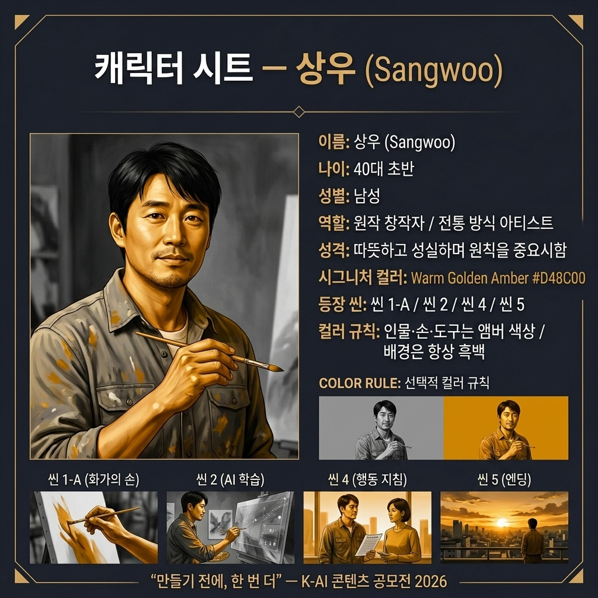
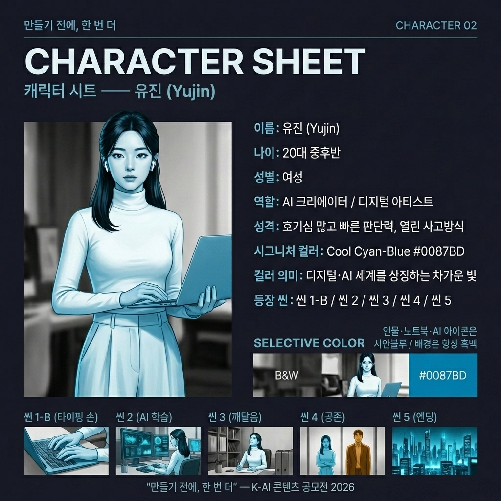
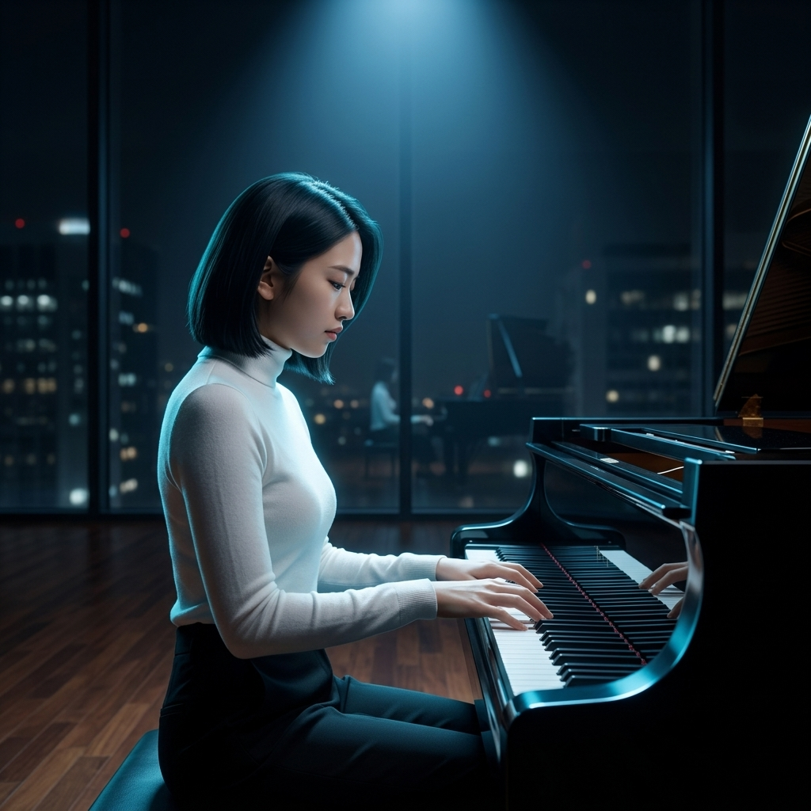
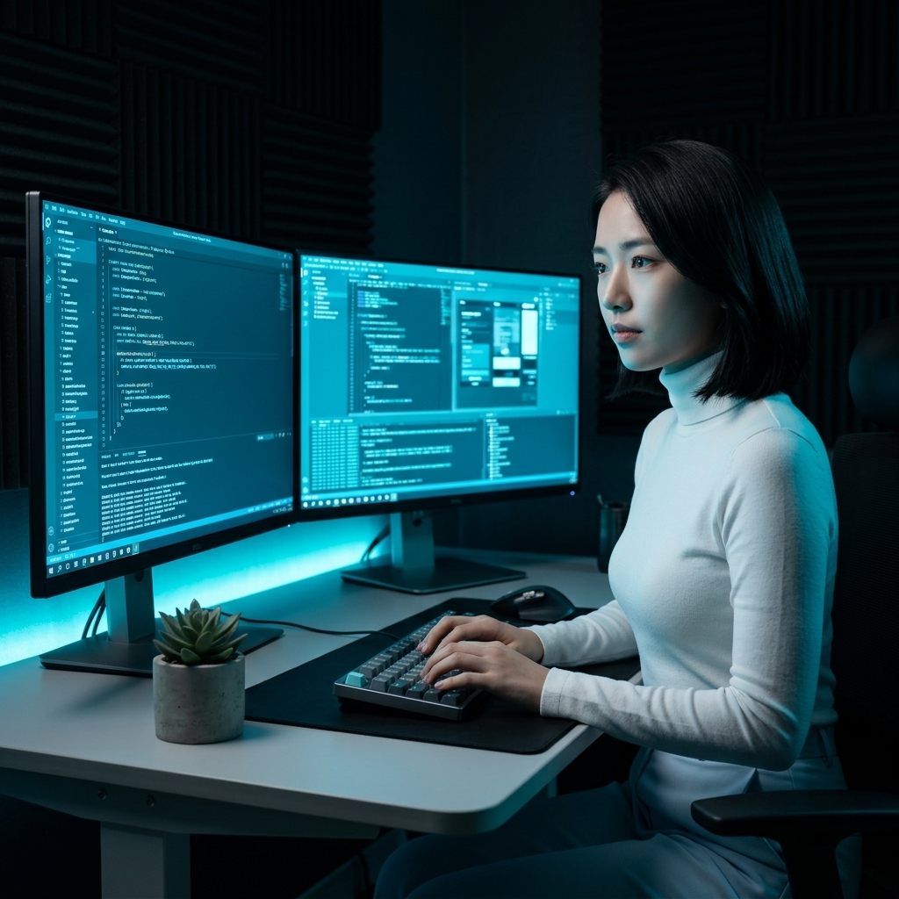
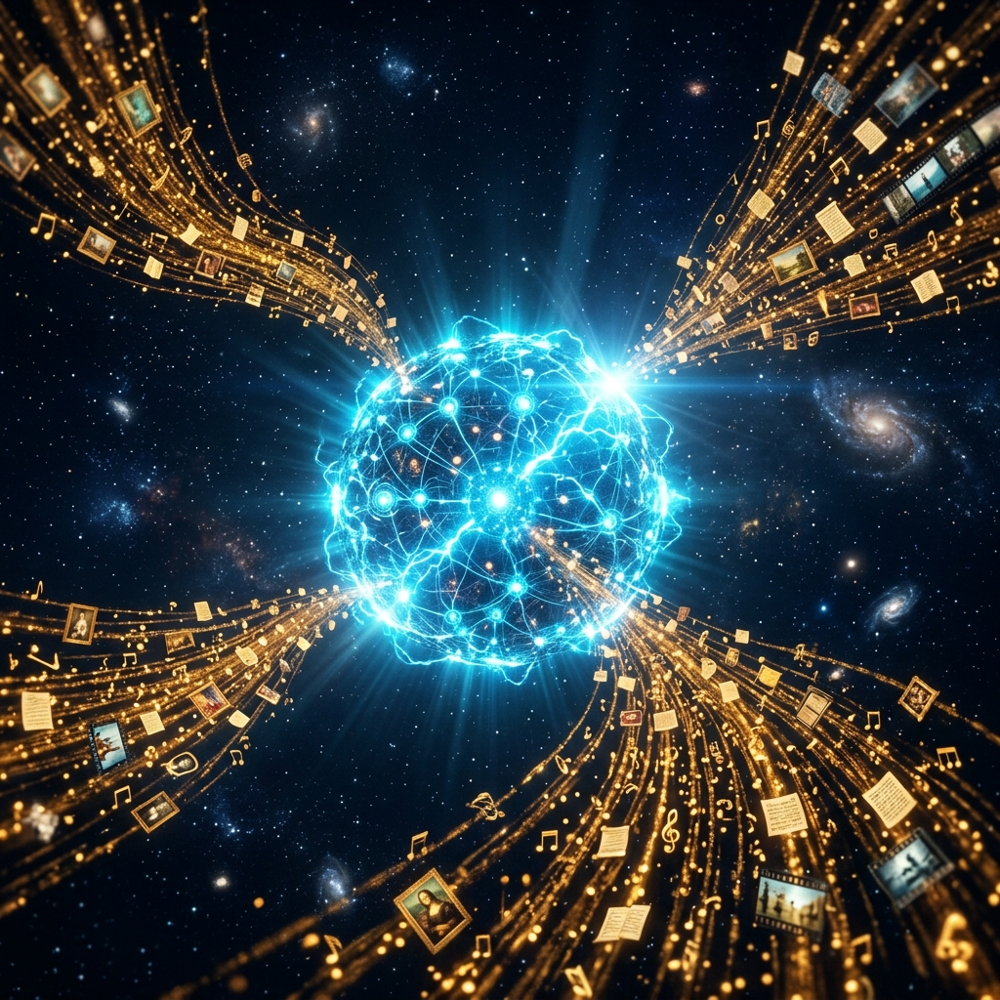
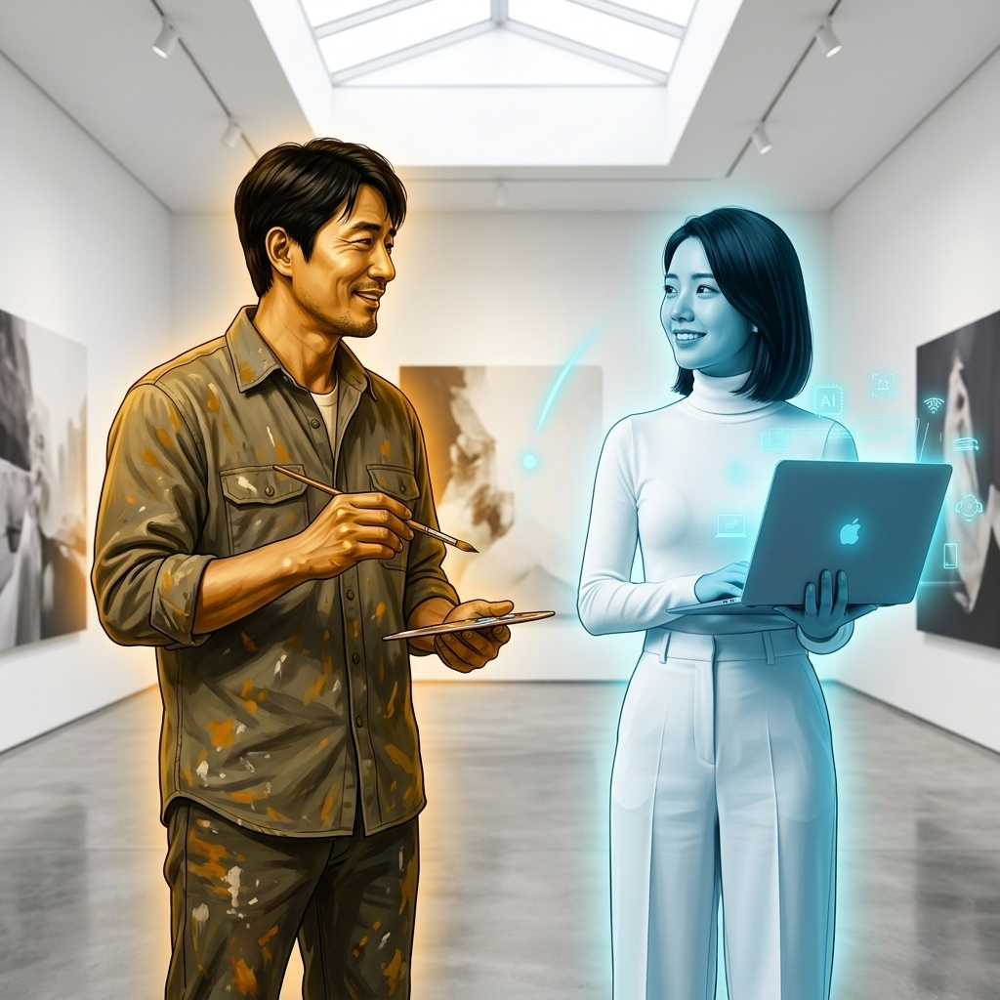

# 🎬 GenAI 기초2 멀티모달 콘텐츠 제작
AI 기반 멀티모달 광고 제작 프로젝트: "만들기 전에, 한 번 더"

스토리보드(기획) 문서 (PDF) 를 이 readme.md 및 html 배포판으로 대체합니다
https://swmilk4u.github.io/N_B1-2/


## 📌 1. 브랜드(캠페인) 아이덴티티

| 항목 | 상세 내용 |
| :--- | :--- |
| **브랜드(캠페인)명** | 만들기 전에, 한 번 더 (Think Once More, Before You Create) |
| **공모 주제** | **AI 윤리 준수** — 생성형 AI 사용 시 지켜야 할 에티켓 및 저작권 보호 |
| **핵심 메시지** | **"AI로 만들 때도, 창작자를 먼저 생각합니다."** |
| **슬로건** | 만들기 전에, 한 번 더. |
| **타겟** | 생성형 AI 창작 도구를 사용하는 대학생, 크리에이터 및 일반인 (20~40대) |
| **톤앤매너** | 미니멀, 감성적 / 차분하고 여운이 있는 시네마틱 스타일 |
| **차별점(USP)** | 단순히 기술을 자랑하는 것을 넘어, "AI 생성물에서도 원작자의 권리를 존중하는 태도" 자체가 새로운 창작 문화임을 감성적으로 표현 |


### 제작 파이프라인 및 사용 도구 비교

본 프로젝트는 기획 의도가 프롬프트를 거쳐 최종 영상으로 구현되기까지 전체 프로세스를 생성형 AI 도구 위주로 구축하였습니다.

```
[1. 기획 & 아이덴티티] ➔ [2. 스토리보드 & 프롬프트 설계] ➔ [3. AI 리소스 생성] ➔ [4. 편집 및 오디오 통합] ➔ [5. 최종 검토 및 수정]
```

### 버전별 사용 도구 세부 비교

| 프로세스 구분 | Version 1 (v1) | Version 2 (v2) | 도구 선택 사유 |
| :--- | :--- | :--- | :--- |
| **텍스트/기획** | 네이토 | Google Gemini | 브랜드 아이덴티티 수립 및 서사 구조(기승전결) 브레인스토밍 |
| **이미지 생성** | **네이토** | **Google Gemini** | - **네이토**: 선명한 텍스트 묘사 및 플랫 일러스트 제작 우수<br>- **Gemini**: 프롬프트 충실도가 높고 고품질 시네마틱 이미지 생성 탁월 |
| **비디오 변환** | **네이토** | **Google Veo** | 정적인 키비주얼 이미지에 씬별 의도에 맞는 세밀한 물리 모션(카메라 줌, 입자 움직임) 부여 |
| **음성 합성(TTS)**| **네이토** | **Google Vetex TTS** | 차분하고 진정성 있는 자연스러운 한국어 나레이션 합성 |
| **배경음악(BGM)** | 공모전 공식 지정 음원 | 공모전 공식 지정 음원 | 공모전 필수 규정 준수 (지정 음원 활용) |
| **영상 편집** | **네이토** | **다빈치리졸브** | 컷 편집, 자막 삽입, AI 워터마크 노출, 오디오 믹싱 및 페이드아웃 통합 |


---

## 🎨 2 스토리보드

### 🎬 씬별 상세 스토리보드
캐릭터 시트를 적극 반영하여 통일성 있는 광고 영상을 제작했습니다.

#### 👥 캐릭터 시트: 상우 (Sangwoo)
* **시각 자료**:
  <p align="center"></p>

#### 👥 캐릭터 시트: 유진 (Yujin)
* **시각 자료**:
  <p align="center"></p>

---

#### 씬 1 — 오프닝: 창작자의 손 (0~7초, 총 7초)
* **목표 메시지**: 사람의 유기적인 창작 행위를 시네마틱 클로즈업으로 조명합니다.
* **화면 구성**: 명암 대비(Chiaroscuro)가 두드러지는 고풍스러운 조명 아래 화가(붓), 피아니스트(건반), 작가(키보드)의 정밀한 손동작 3컷 교차.
* **내레이션/카피**: (BGM 및 씬 연출)
* **이미지 프롬프트 (Gemini)**:
  - *(Painter)*: `A dramatic close-up of a painter's hand holding a fine brush, making a single delicate stroke on a white canvas. Chiaroscuro lighting, dark studio background, warm golden highlights, shallow depth of field, cinematic, photorealistic, 4K.`
  - *(Pianist)*: `A close-up of elegant fingers resting on black and white piano keys, soft dramatic studio lighting, dark blurred background, cool blue and white tones, shallow depth of field, cinematic, photorealistic, 4K.`
  - *(Writer)*: `A close-up of a writer's hand typing on a mechanical keyboard, fingers mid-keystroke, one key in sharp focus, dark moody background, desaturated cool tones with warm fingertip highlight, cinematic, photorealistic, 4K.`
* **모션 프롬프트 (Veo)**:
  `Cinematic slow motion, subtle finger movements, camera slowly focusing on details, 24fps.`
* **스토리보드 시각 자료**:
  | 컷 A: 화가의 손 | 컷 B: 피아니스트의 손 | 컷 C: 작가의 손 |
  | :---: | :---: | :---: |
  |  |  |  |

---

#### 씬 2 — 기승: AI 학습 시각화 (7~17초, 총 10초)
* **목표 메시지**: 인류의 광범위한 데이터가 AI 기술의 근간임을 예술적으로 표현합니다.
* **화면 구성**: 깊고 어두운 우주 공간. 무수히 빛나는 디지털 파티클(그림 조명, 소절, 문장 조각 등)이 은하수처럼 휘돌며 중앙의 AI 뉴럴 네트워크로 흡수되는 SF 시네마틱 씬.
* **내레이션/카피**: *"이 모든 창작물이... AI를 만들었습니다."*
* **이미지 프롬프트 (Gemini)**:
  `An abstract digital visualization of thousands of tiny artworks, music notes, handwritten text, and painting fragments all flowing and converging into a single glowing AI neural network icon at the center. Deep dark navy space background, electric blue and white luminous particles, flowing data streams, cinematic, high contrast, dramatic, 4K.`
* **모션 프롬프트 (Veo)**:
  `Thousands of tiny image and text particles swirl and stream inward, converging into the central glowing AI icon which pulses with light, smooth flowing motion.`
* **스토리보드 시각 자료**:
  <p align="center"></p>

---

#### 씬 3 — 전환: 당신도 이제 창작자 (17~25초, 총 8초)
* **목표 메시지**: 기술과 함께 상상력을 펼쳐가는 신진 창작자들의 등장을 축하합니다.
* **화면 구성**: 따스한 아침 햇살이 창문을 통해 내리쬐는 세련된 작업실. 노트북 앞에 앉아 미소를 머금고 작업에 열중하고 있는 창작자 '상우'의 실루엣 샷. 따뜻한 입자와 렌즈 플레어 강조.
* **내레이션/카피**: *"이제, 당신도 창작자입니다."*
* **이미지 프롬프트 (Gemini)**:
  `A medium shot of a 20s male creator Sangwoo's silhouette sitting at a desk with a laptop, the laptop screen glowing brightly showing colorful AI-generated artwork. Soft warm sunlight streaming through a window behind the figure, golden dust particles floating in the light, lens flare, cinematic, hopeful atmosphere, photorealistic, 4K.`
* **모션 프롬프트 (Veo)**:
  `The person slowly raises their head and looks at the glowing screen, warm sunlight gradually brightens, cinematic slow motion.`
* **스토리보드 시각 자료**:
  <p align="center"></p>

---

#### 씬 4 — 결: 공존을 위한 행동 지침 (25~35초, 총 10초)
* **목표 메시지**: 건강한 AI 창작 생태계를 지키기 위한 3대 핵심 에티켓 행동 지침 명시.
* **화면 구성**: 백색의 깔끔한 가로형 2분할 화면. 왼쪽은 전통 화판을 두고 작업하는 화가, 오른쪽은 노트북으로 생성하는 AI 창작자. 서로를 바라보며 밝게 인사하고 악수하는 미니멀 벡터 캐릭터 일러스트레이션.
* **내레이션/카피**: *"출처를 밝히고, 허락을 구하고, 창작자를 존중합니다."*
* **이미지 프롬프트 (Gemini)**:
  `A minimalist flat vector illustration of two friendly figures standing side by side. Left figure: an artist holding a paintbrush and color palette. Right figure: a person using a laptop with a small glowing star icon on the screen. Clean white background, pastel color palette of soft blue and warm yellow, simple geometric shapes, balanced and warm composition, no text, no shadows.`
* **모션 프롬프트 (Veo)**:
  `The two figures simultaneously turn toward each other and nod gently, subtle friendly animation, soft pastel glow between them.`
* **스토리보드 시각 자료**:
  <p align="center"></p>

---

#### 씬 5 — 엔딩: 슬로건 및 워터마크 (35~40초, 총 5초)
* **목표 메시지**: 행동하는 AI 윤리의 핵심 결말로서 깊은 여운을 남깁니다.
* **화면 구성**: 짙은 네이비 블랙(#0D1B2A) 백그라운드 위로 흰색의 텍스트 타이포그래피 등장. 우측 하단에 공식 워터마크 노출하며 페이드아웃.
* **내레이션/카피**: *"만들기 전에, 한 번 더. (자막: 만들기 전에, 한 번 더 / AI로 만들 때도, 창작자를 먼저 생각합니다.)"*
* **제작 방식**: CapCut 텍스트 및 사운드 오버레이 편집

---

## 📈 3. 프롬프트 엔지니어링 개선 로그 (씬 2 기준)

원하는 기획 의도와 광고의 고화질 시네마틱 톤앤매너를 일관성 있게 구현하기 위해 반복적인 프롬프트 수정 과정을 거쳤습니다.

| 수정 구분 | 씬 2 개선 과정 및 텍스트 변화 |
| :--- | :--- |
| **수정 전 프롬프트** | `many images and text flowing into an AI icon` |
| **발생한 한계점** | - 단순한 카툰 및 일러스트 풍으로 형성되어 광고 전체의 시네마틱 무드와 이질감 발생.<br>- 유입되는 입자(창작물 조각)들의 밀도와 긴장감이 낮아 AI 학습 과정의 시각적 카리스마 부족. |
| **개선 및 튜닝 전략** | 1. **화풍 명시**: `abstract digital visualization`, `cinematic, dramatic, 4K` 추가<br>2. **컬러 배합 고정**: `Deep dark navy space background`, `electric blue and white luminous particles` 적용<br>3. **소재의 구체성 확보**: 단순 image/text 대신 `thousands of tiny artworks, music notes, handwritten text, and painting fragments` 명시하여 다양성 부여 |
| **수정 후 프롬프트** | `An abstract digital visualization of thousands of tiny artworks, music notes, handwritten text, and painting fragments all flowing and converging into a single glowing AI neural network icon at the center. Deep dark navy space background, electric blue and white luminous particles, flowing data streams, cinematic, high contrast, dramatic, 4K.` |
| **개선 결과** | 우주 공간을 연상시키는 신비로운 백그라운드에 세밀한 텍스트 및 오디오 파티클이 광활하게 움직여 완성도 높은 AI 수렴 컷을 얻을 수 있었습니다. |


---

### 제약 사항 및 자율 점검표

공모전 출품 요건 및 학습 과제 목표의 철저한 수행을 위해 다음 제약 사항들을 자율 점검하였습니다.

* **[x] 소스 저작권 준수**: 외부의 상업용 유료 스톡 비디오나 직접 촬영한 실사 촬영물은 전혀 사용하지 않았으며, 순수 AI 생성 소스와 공모전 지정 리소스로만 영상을 구성하였습니다.
* **[x] 공식 BGM 및 워터마크 적용**: 공모전 주최측에서 무료 배포한 지정 음원(BGM)만을 사운드 트랙으로 설정하였으며, 영상 전체 구간 우측 하단에 규격화된 AI 워터마크를 투명도 100%로 정상 배치 완료하였습니다.
* **[x] 편집기 남용 금지**: CapCut 편집 도구는 단순히 컷 편집, 나레이션 타이밍 싱크, 순차 자막 타이포그래피 구현 등의 "최종 통합 용도"로만 사용하였으며, 핵심 비주얼은 AI 생성 품질에 의존하도록 설계했습니다.
* **[x] 윤리적 안전망**: 타인의 지적 재산 침해 예방, 딥페이크 악용 소지 차단, 기타 유해 콘텐츠(혐오, 폭력) 생성 요소가 없는지 면밀히 전수 검토하였습니다.

---

## 4. 📐 최종 영상 파일 정보(v2 기준)
* **영상 결과물**: 최종파일 유튜브 URL링크
* **총 길이**: 40초 (~60초 규정 준수)
* **해상도**: 1920 × 1080 (1080p, 16:9 가로형)
* **프레임레이트**: 24fps
* **비디오 코덱**: H.264
* **오디오 코덱**: AAC
* **기타 필수 사항**: 우측 하단 공모전 공식 AI 워터마크 항시 노출
---

### 최종 결과물 (YouTube 링크)

제작 파이프라인을 거쳐 완성된 2가지 버전의 최종 광고(캠페인) 영상입니다. 아래 링크를 통해 확인하실 수 있습니다.

| 버전 | 설명 및 주요 특징 | 최종 영상 링크 |
| :---: | :--- | :---: |
| **Version 1 (v1)** | **네이토 리소스 제작 버전**<br>- 디자인의 정밀성과 텍스트 레이아웃의 선명함을 강조한 버전 | [](https://youtu.be/KtgdGovpGg4) |
| **Version 2 (v2)** | **캐릭터 일관성을 고려한 제작 디벨롭 버전**<br>- 극적이고 사실적인 시네마틱 라이팅과 정밀한 캐릭터 일관성 제어(상우 캐릭터 시트 적용) 버전 | [](https://youtu.be/D4NRefoG0YI) |

